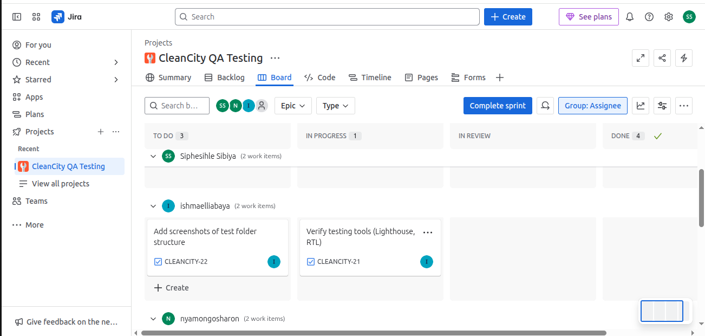
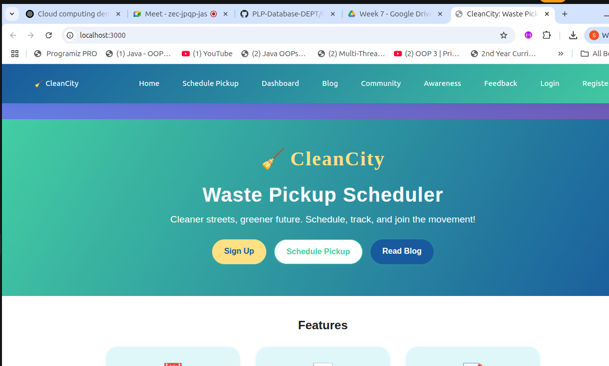

# Test Plan – CleanCity QA

## Phase 1 – Setup & Strategy

### Setup Verification

The application has been installed and runs successfully:

**Figure 1:** Screenshot showing app running in the browser

<!--
# Test Plan – CleanCity QA

## 1. Introduction

This document outlines the testing strategy, objectives, scope, and approach for the CleanCity project to ensure delivery of a high-quality application.

## 2. Objectives & Scope

- Validate all core features: user registration, login, scheduling pickups, dashboard, admin panel, blog, community, and feedback.
- Ensure accessibility, usability, and responsiveness across devices.
- Identify and log defects early in the development cycle.

## 3. Test Strategy

- **Manual Testing:**  
  - Exploratory and scenario-based testing for all user flows.
  - UI/UX validation on desktop and mobile.
- **Automated Testing:**  
  - Unit and integration tests using Jest and React Testing Library.
  - Lighthouse audits for performance and accessibility.
- **Defect Tracking:**  
  - All issues logged in `tests/defect-log.md` and Jira.

## 4. Roles & Responsibilities

| Team Member   | Role                                 | Responsibilities                                      |
|---------------|--------------------------------------|-------------------------------------------------------|
| Siphesihle    | Manual Testing & Setup Lead          | Manual test case design, execution, defect logging    |
| Ishmael       | Automation & Tooling Engineer        | Automated test scripts, tooling, reporting            |
| Sharon        | Documentation & Functional Testing   | Test documentation, coverage summary, reporting       |

## 5. Test Environment

- **Frontend:** React app (`npm start`)
- **Browsers:** Chrome, Firefox, Edge
- **Devices:** Desktop, mobile (responsive testing)
- **Test Data:** Sample user accounts (admin, regular)

## 6. Test Deliverables

- `test-plan.md` (this document)
- `test-cases.md` (detailed test cases & checklists)
- `defect-log.md` (defect/issue log)
- Screenshots, logs, and final report

## 7. Schedule & Milestones

| Phase                  | Deliverable(s)           | Due Date           |
|------------------------|-------------------------|--------------------|
| Setup & Planning       | Test plan, environment  | July 2, 2025       |
| Test Design & Execution| Test cases, scripts     | July 9, 2025       |
| Reporting              | Final report, logs      | July 16, 2025      |

## 8. Risks & Mitigations

- **Limited device coverage:** Use browser emulators and real devices where possible.
- **Tooling issues:** Early setup and validation of test tools.
- **Time constraints:** Prioritize critical user flows for early testing.

## 9. Setup Verification

The application has been installed and runs successfully:

**Figure 1:** Screenshot showing app running in the browser

---

*Update this plan as the project progresses and new risks or requirements

-->
## Phase 2 – Test Execution & Reporting
<!-- 
...existing code...

---

## 10. Week 2: Test Design & Early Execution

### 10.1 Test Case & Checklist Drafting

- Drafted initial test cases for core features (see `test-cases.md`):
  - User registration and login
  - Scheduling pickups
  - Dashboard navigation and data display
  - Admin panel access and controls
  - Blog and community features
  - Feedback submission
- Created checklists for UI/UX, accessibility, and responsiveness.

### 10.2 Early Test Scripts

- Manual test scripts executed for main user flows.
- Automated test scripts initiated using Jest and React Testing Library (see `tests/` folder).
- Lighthouse audits run for performance and accessibility.

### 10.3 Defect/Issue Logging

- Initial defects and issues logged in `defect-log.md`.
- Bugs categorized by severity and feature area.

### 10.4 Challenges & Changes

- **Test Data:** Needed to create multiple user accounts for admin/regular roles.
- **Tooling:** Minor issues with initial Jest setup, resolved by updating dependencies.
- **Coverage:** Some edge cases identified for further testing in Week 3.
- **Documentation:** Adjusted test case format for clarity and traceability.

---

*This section will be updated as additional test cases, scripts, and defects are added during Week 2.*
 -->
 ##  Documentation of any challenges or changes
- **Test Data Creation**: Needed to create multiple user accounts for admin and regular roles.
- **Tooling Issues**: Minor issues with initial Jest setup, resolved by updating dependencies.
- **Coverage Gaps**: Some edge cases identified for further testing in Week 3.
- **Documentation Adjustments**: Test case format updated for clarity and traceability.
